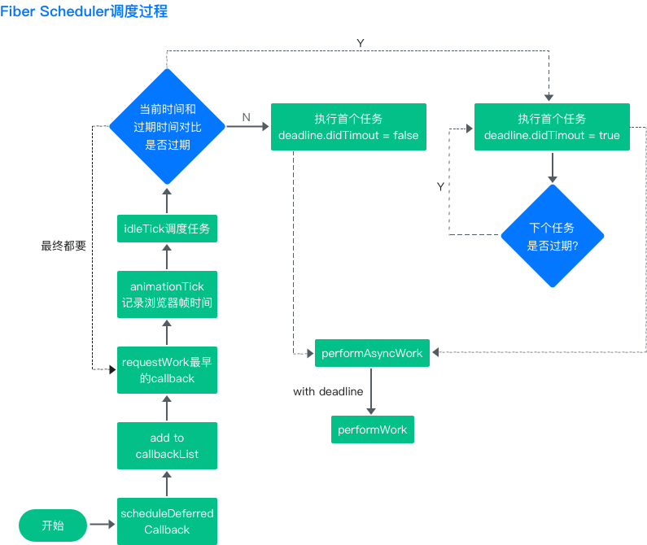

# Scheduler 调度

## 初始化阶段

### ReactDOM.render

初始化阶段

* 请求当前Fiber节点的lane（优先级）
* 结合lane（优先级）创建当前Fiber节点的update对象
* 调度当前节点（rootFiber）

performSyncWorkOnRoot是render阶段的起点

render阶段的任务就是完成Fiber树的构建

## 参考资料

React 16 Fiber Scheduler 调度过程 

React 17 Fiber Scheduler 调度过程 

改成了使用line

