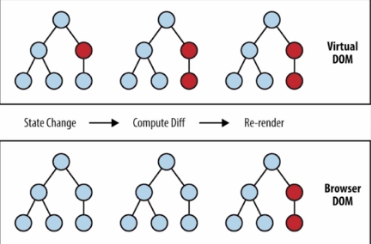

# React 虚拟DOM思考

## React 虚拟DOM思考

### 1.虚拟DOM+components+生命周期的联系

#### React-虚拟DOM分析

* 从浏览器渲染角度说React为什么会使用虚拟DOM
* 虚拟DOM的原理
* 以下是综各个资料后的个人理解，如有问题请指出

**从浏览器渲染角度说React**

* 首先要知道`React`是由`Facebook`对现有业务进行改进提升的时候提出来的。`DOM`是很慢的，其元素非常庞大，页面的性能问题鲜有由JS引起的，大部分都是由DOM操作引起的。所有`Facebook`在`React`中引入了页面UI组件化、虚拟DOM，来解决这些问题。
* React.js对常用组建进行了优化,它算是一个components组件库。ReactDom.js是React版本优化的虚拟DOM
* 如果要渲染到最后Display显示，需要经过很长过程，浏览器会先收集到HTML和CSS，对HTML和CSS分别经过Parser剖析器，分别生成DOMTree和CSSRuleTree。 DOM和CSSOM合并后生成Render Tree。
* React.js希望用JSX语言写出HTML和CSS还有页面逻辑混合在一起成为一个component，（在react编写的时候就是通过class继承的react.component这个类），直接通过JS对象的形式生成了`ReactRenderTree`。
* 我觉得这是原型链的🌲树状结构化，`ReactRenderTree`（React生命周期）在通过虚拟DOM（ReactDom.js），首次生成给到浏览器的时候就是一个浏览器直接可以识别的RenderTree，浏览器直接Painting，然后显示在页面上。
* 虚拟的DOM的核心思想是：对复杂的文档DOM结构，提供一种方便的工具，进行最小化地DOM操作

**当需要重排时Reflow**

* `React`会通过虚拟`DOM`对新生成的DOM和原来的DOM树进行对比，改变页面

**虚拟DOM的原理**

* 虚拟`DOM`类似于（自动化控制的网页生成器）通过`Node`节点`render`生成相对应的网页，但主要功能在于网页更新时候，对于Node节点的更新，虚拟DOM会比较两棵DOM树的区别，保证最小化的DOM操作，使得执行效率得到保证。
* 由于计算两棵树的常规算法是`O(n^3)`级别，DOM结构达到成百个节点在实际项目中很正常，所以需要优化深度遍历的算法。

**React diff 策略**

* `Web UI` 中 `DOM` 节点跨层级的移动操作特别少，可以忽略不计。
* 拥有相同类的两个组件将会生成相似的树形结构，拥有不同类的两个组件将会生成不同的树形结构。
* 对于同一层级的一组子节点，它们可以通过唯一 id 进行区分。
* 基于以上三个前提策略，`React` 分别对 `tree diff`、`component diff` 以及 `element diff` 进行算法优化，事实也证明这三个前提策略是合理且准确的，它保证了整体界面构建的性能。
* React的局限性，不适合每个页面使用率很低网站，（每个页面页面逻辑不同）;

[](https://camo.githubusercontent.com/289a50d2838a83515ce740ad40e493ea009e4e8b/68747470733a2f2f706963332e7a68696d672e636f6d2f37346138366662636338626234616437346531396237326137326232366335365f722e706e67)

[知乎-React 源码剖析系列 － 不可思议的 react diff](https://zhuanlan.zhihu.com/p/20346379)

**React-生命周期**

* `ReactNode`节点是由JS制作而成，本身是死的，要赋予其活性，就需要像现实事物一样有生命周期。通过生命周期函数，来间接控制事件与DOM的操作！！！
* 为了方便这样的操作React有了JSX这种语法融合了`HTML`和`CSS`，不难看出使用这种语法能极大的提高React性能（从浏览器渲染的角度）

[](https://camo.githubusercontent.com/2d82a2e67c415a05b33005d0f500c679d34b2639/687474703a2f2f75706c6f61642d696d616765732e6a69616e7368752e696f2f75706c6f61645f696d616765732f313831343335342d346266363265353435353361333262372e706e673f696d6167654d6f6772322f6175746f2d6f7269656e742f7374726970253743696d61676556696577322f322f772f31323430)

## 2.Virtual DOM 与 React Diff算法

## 

#### Example\([virtual dom](https://github.com/Matt-Esch/virtual-dom#example)\)

```javascript
var h = require('virtual-dom/h');
var diff = require('virtual-dom/diff');
var patch = require('virtual-dom/patch');
var createElement = require('virtual-dom/create-element');

// 1: Create a function that declares what the DOM should look like
// 1：创建一个render函数，声明了DOM应该是什么样子
function render(count)  {
    return h('div', {
        style: {
            textAlign: 'center',
            lineHeight: (100 + count) + 'px',
            border: '1px solid red',
            width: (100 + count) + 'px',
            height: (100 + count) + 'px'
        }
    }, [String(count)]);
}

// 2: Initialise the document
// 2：初始化传入的参数，主要是页面需要改变得数据
var count = 0;      // We need some app data. Here we just store a count.

var tree = render(count);               // We need an initial tree 实例化一个树节点在内存当中，也就是我们定义的这个render树
var rootNode = createElement(tree);     // Create an initial root DOM node ... 通过CreateElement创建一个真实的DOM节点插入到DOM结构中
document.body.appendChild(rootNode);    // ... and it should be in the document 把节点嵌入到页面当中

// 3: Wire up the update logic
// 3：写一个升级树的过程
setInterval(function () {
      count++;

      var newTree = render(count);//新的生成树
      var patches = diff(tree, newTree);//diff算法对比出修改的页面
      rootNode = patch(rootNode, patches);//patch更改页面
      tree = newTree;//树赋值成新树
}, 1000);
```

