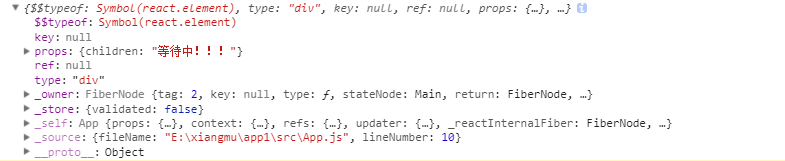
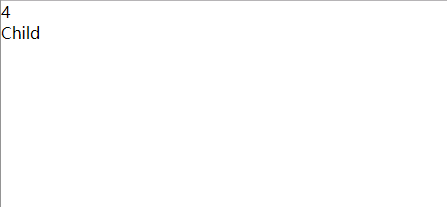

# React 组件Child

我们先来看一个例子

```javascript
import React from 'react';
import Main from './Main';
import Child from './Child';

class App extends React.Component {
  render() {
    return (
      <div className="App">
       <Main id='4'>
        {(files)=>files?<Child files={files}></Child>:<div>等待中！！！</div>}
       </Main>
      </div>
    );
  }
}

export default App;
```

在App组件中，其中Main组件中包含了一个Child组件，这个Child组件就是Main组件的子组件。

接下来我们看看Main和Child中写了些什么

* 组件Main

```javascript
import React from 'react';

class Main extends React.Component {
  constructor(props) {
    super(props)
    this.state = {
      files:''
    }
  }
  componentDidMount(){
    const title = this.props.id
    this.setState({files:title})
  }
  render(){
    const children = this.props.children(this.state.files)
    return(
      <div>{children}</div>
    )
  }
}

export default Main
```

* 组件Child

```javascript
import React from 'react';

class Child extends React.Component {
  constructor(props) {
    super(props)
    }
  render(){
    return(
      <div>
       {this.props.files}
       <div>Child</div>
      </div>
    )
  }
}

export default Child
```

在这里我通过React的组件Child，来进行操作。可以通过`this.props.children`来得到父组件Main之下的子组件Child

在App组件中通过props传递给Main组件一个名为id的参数，使用`?:`进行一个判断如果，files值有传递那就渲染Child，如果没有那就渲染等待中组件

```javascript
<div className="App">
  <Main id='4'>
    {(files)=>files?<Child files={files}></Child>:<div>等待中！！！</div>}
  </Main>
</div>
```

在Main中接受props传递过来的props。通过处理props，改变state，从而改变传递给子组件的state

```javascript
componentDidMount(){
 const title = this.props.id
 this.setState({files:title})
}
render(){
 const children = this.props.children(this.state.files)
 return(
 <div>{children}</div>
 )
}
```

关键的问题是获取子组件，所以就引出了最重要的一环`this.props.children`

这里的`this.props.children(this.state.files)`只是获取子组件，而且子组件也不会自动渲染，需要在父组件中渲染一次，所以要`return(<div>{children}</div>)`，这样才能真正渲染出子组件。

## this.props.children

我们来看看在Main组件中我们能通过`this.props.children`获取什么。

它获取到了整个三目运算符判断后的结果为`<div>等待中！！！</div>`，因为此时还没有进行setState，在经过setState后它就变成了`<Child files={files}></Child>`，这样就可以渲染Main的子组件。如下图



