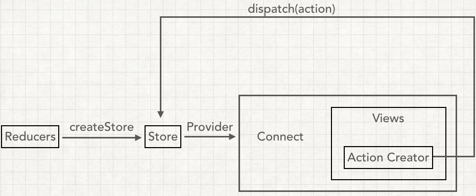

# Redux 使用



* 通过`reducer`新建`store`，随时通过`store.getState`获取状态
* 需要状态变更，`store.dispatch(action)`来修改状态
* `reducer`函数接受`state`和`action`，🔙返回🆕新的`state`，可以用`store.subscribe`监听每次修改

### `index.js`

```javascript
import {createStore} from 'redux'

function counter(state=0,action) {
  switch (action.type) {
    case 'add':
      return state+1;
    case 'reduce':
      return state-1;
    default:
      return 10
  }
}

//新建store
const store = createStore(counter);
const init = store.getState();
console.log(init);

//监听
function listener() {
  const current = store.getState();
  console.log(`现在有的${current}`);
}
store.subscribe(listener)

//派发事件 传递aciton
store.dispatch({type:'add'});
store.dispatch({type:'reduce'});
store.dispatch({type:'add'});
store.dispatch({type:'add'});
```

## Action

action 内必须使用一个字符串类型的`type`字段来表示将要执行的动作。多数情况下，`type`会被定义成字符串常量。当应用规模越来越大时，建议使用单独的模块或文件来存放 `action`。

## Action创建函数

**Action 创建函数**就是生成 action 的方法。

```javascript
// action creator

export function add() {
  return {type:ADD};
};
export function reduce() {
  return {type:REDUCE};
};
```

