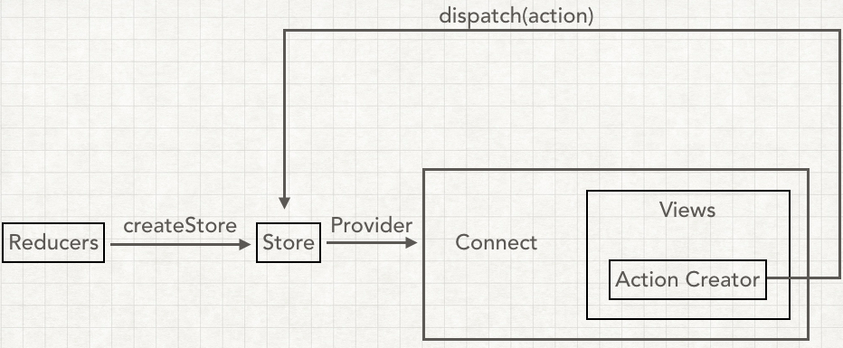
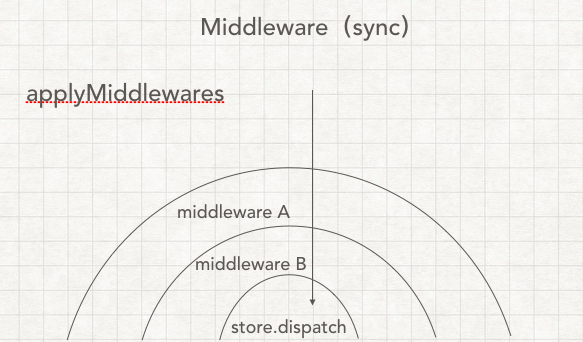

# Redux 自制Redux

#### 简版Redux基本实现



* tyrmars-redux.js

```javascript
export function createStore(reducer) {
  let currentState = {}//状态树
  let currentListeners = []//state改变后监听

  function getState() {
    return currentState
  }

  function subscribe(listener) {
    //传入函数
    currentListeners.push(listener)//放入一个监听器
  }

  function dispatch(action){
    currentState = reducer(currentState,action)
    currentListeners.forEach(v=>v())
    return action
  }

  //触发初始状态
  dispatch({type:'@TYRMARS/Mars-Redux'})

  return {getState,subscribe,dispatch}
}
```

**测试与redux的过程分析**

```javascript
import {createStore} from './TYRMars-redux'

//新建数据存放点
const store = createStore(counter)

//对于reducer处理函数，参数是状态和新的aciton
function counter(state=0,action) {
  switch (aciton.type) {
    case '+':
       return state+1
    case '-':
       return state-1
    default:
      return state
  }
}

//监听state的状态
function listerner() {
  const current = store.getState()
  console.log(`num is ${current}`)
}

//订阅每一次state修改，都会执行listener
store.subscribe(listener)

//触发动作
store.dispatch({type:'+'})
store.dispatch({type:'-'})
```

使用上部的自制redux可以看出

1. 使用函数createStore创建store数据点
2. 创建Reducer。在介绍Redux的时候，我们就知道Reducer这个🈯️指的是要改变的组件，它获取`state`和`action`，生成新的`state`，
3. 用subscribe监听每次修改情况
4. dispatch执行，reducer\(currentState,action\)处理当前dispatch后的传入的action.type并返回给currentState处理后的state，通过currentListeners.forEach\(v=&gt;v\(\)\)执行监听函数，并最后返回当前 action状态

#### React 中的使用

```javascript
const store = createStore(counter)

function render() {
  ReactDom.render(<App store={store} />,document.getElementById('root'));
}
render();

store.subscribe(render)
```

简版的Redux，采用subscribe每次监听render

## 配合[自制React-Redux](react-zi-zhi-react-redux.md) <a id="&#x81EA;&#x5236;react-redux"></a>

```javascript
export function createStore(reducer) {
  let currentState = {}
  let currentListeners = []

  function getState() {
    return currentState
  }

  function subscribe(listener) {
    //传入函数
    currentListeners.push(listener)
  }

  function dispatch(action){
    currentState = reducer(currentState,action)
    currentListeners.forEach(v=>v())
    return action
  }

  //触发初始状态
  dispatch({type:'@TYRMARS/Mars-Redux'})

  return {getState,subscribe,dispatch}
}

function bindActionCreator(creator,dispatch){
  return (...args) => dispatch(creator(...args))
}

export function bindActionCreators(creators,dispatch){
  let bound = {}
  Object.keys(creators).forEach(v=>{
    let creator = creators[v]
    bound[v] = bindActionCreator(creator,dispatch)
  })
  return bound
}
```

* 对于`bindActionCreators`的改进

```javascript
export function bindActionCreators(creators,dispatch){
  return Object.keys(creators).reduce((ret,item)=>{
    ret[item] = bindActionCreator(creators[item],dispatch)
    return ret
  },{})
}
```

## applyMiddleware中间件实现



通过之前对于applyMiddleware中间件的理解，在此我将要实现Redux中间件

**实现传入一个函数**

```javascript
export function createStore(reducer,enhancer) {
  if(enhancer) {
    return enhancer(createStore,reducer)
  }
  let currentState = {}
  let currentListeners = []

  function getState() {
    return currentState
  }

  function subscribe(listener) {
    //传入函数
    currentListeners.push(listener)
  }

  function dispatch(action){
    currentState = reducer(currentState,action)
    currentListeners.forEach(v=>v())
    return action
  }

  //触发初始状态
  dispatch({type:'@TYRMARS/Mars-Redux'})

  return {getState,subscribe,dispatch}
}

function bindActionCreator(creator,dipatch){
  return (...args) => dispatch(creator(...args))
}

export function bindActionCreators(creators,dispatch){
  let bound = {}
  Object.keys(creators).forEach(v=>{
    let creator = creators[v]
    bound[v] = bindActionCreator(creator,dipatch)
  })
  return bound
}

export function applyMiddleWare(middleware){
   return createStore=>(...args)=>{
      //生成原生的store
      const store = createStore(...args)
      //获取原生的dispatch
      let dispatch = store.dispatch
      //生成一个中间件的API
      const midApi = {
        getState:store.getState,
        dispatch:(...args)=>dispatch(...args)
      }
      dispatch = middleware(midApi)(store.dispatch)(action)
      // middleware(midApi)(store.dispatch)(action)
      return {
        ...store,
        dispatch
      }
   }
}
```

## compose

### compose.js

```javascript
// compose(fn1,fn2,fn3)
// fn1(fn2(fn3))
export function compose(...funcs){
  if (funcs.length === 0) {
    return arg=>arg
  }
  if (funcs.length === 1) {
    return funcs[0]
  }
  return funcs.reduce((ret,item) => (...args) => ret(item(...args)))
}
```

### createStore.js

```javascript
export function createStore(reducer,enhancer) {
  if(enhancer) {
    return enhancer(createStore,reducer)
  }
  let currentState = {}
  let currentListeners = []

  function getState() {
    return currentState
  }

  function subscribe(listener) {
    //传入函数
    currentListeners.push(listener)
  }

  function dispatch(action){
    currentState = reducer(currentState,action)
    currentListeners.forEach(v=>v())
    return action
  }

  //触发初始状态
  dispatch({type:'@TYRMARS/Mars-Redux'})

  return {getState,subscribe,dispatch}
}

function bindActionCreator(creator,dipatch){
  return (...args) => dispatch(creator(...args))
}

export function bindActionCreators(creators,dispatch){
  let bound = {}
  Object.keys(creators).forEach(v=>{
    let creator = creators[v]
    bound[v] = bindActionCreator(creator,dipatch)
  })
  return bound
}

export function applyMiddleWare(...middlewares){
   return createStore=>(...args)=>{
      //生成原生的store
      const store = createStore(...args)
      //获取原生的dispatch
      let dispatch = store.dispatch
      //生成一个中间件的API
      const midApi = {
        getState:store.getState,
        dispatch:(...args)=>disptach(...args)
      }
      const middlewareChain = middlewares.map(middleware=>middleware(midApi))
      dispatch = compose(...middlewareChain)(store.dispatch)
      //dispatch = middleware(midApi)(store.dispatch)(action)
      // middleware(midApi)(store.dispatch)(action)
      // middlewares.map
      return {
        ...store,
        dispatch
      }
   }
   // middlewares.map...
}
```

