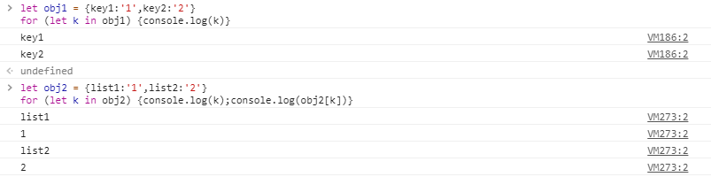

# immutablejs存在的意义和使用

## immutablejs存在的意义和使用

先来看一个事例，就是在JS中对比两个对象

```javascript
let obj = {name:1}
let obj1 = {name:1}

console.log(obj == obj1)//false
```

在JS中无法通过 == 对比两对象是否相等

通过一个对比函数，来对比两个对象是否相等

```javascript
function compareObj(obj1,obj2){
  if(obj1==obj2){
    return true
  }
  if(Object.keys(obj1).length!==Object.keys(obj2).length){
    return false
  }
  for(let k in obj){
    if(obj1[k]!==obj2[k]){
      return false
    }
  }
  return true
}
```



* 查看obj的属性采用for in

通过这样的对比可以实现对比两个对象，但是如果obj内部出现了多层对象

```javascript
let obj = {
  name:'1',
  {
    title:'react'
  }
}
```

如果是这样，我们就必须要考虑深比较

```javascript
function compareObj(obj1,obj2){
  if(obj1==obj2){
    return true
  }
  if(Object.keys(obj1).length!==Object.keys(obj2).length){
    return false
  }
  for(let k in obj){
    if(typeof obj1[k]==='object'){
      return compareObj(obj1[k],obj2[k])
    }else if(obj1[k]!==obj2[k]){
      return false
    }
  }
  return true
}
```

### React中使用

```javascript
class Demo extends React.Component { 
  shouldComponentUpdate(nextProps, nextState){
  if(compareObj(nextProps,this.props)){
    return false
  }
  return true
}
  render() {
    return (<h2>I am Demo，{this.props.title}</h2>)
  }
}

export default App
```

React中对比props，递归对比，复杂度会很高，会严重影响性能

React官方建议，只做浅层比较，所以

```javascript
function compareObj(obj1,obj2){
  if(obj1==obj2){
    return true
  }
  if(Object.keys(obj1).length!==Object.keys(obj2).length){
    return false
  }
  for(let k in obj){
    if(obj1[k]!==obj2[k]){
      return false
    }
  }
  return true
}
```

## immutable.js

查看Github上的 [immutable.js](https://github.com/facebook/immutable-js) - Facebook的一个库（[介绍](http://facebook.github.io/immutable-js/)）

```javascript
import React from 'react'
import { Map } from 'immutable'

class App extends React.Component {
  constructor(props) {
    super(props)
    this.state = {
      num: 1,
      title: 'tyrmars',
      name: 'zhang'
    }
    this.handleClick = this.handleClick.bind(this)
    this.handleTitle = this.handleTitle.bind(this)
  }
  handleClick() {
    this.setState({
      num: this.state.num + 1
    })
  }
  handleTitle() {
    this.setState({
      title:this.state.title + '!'
    })
  }
  render() {
    console.log('render');
    return (<div>
      <h2>I am App{this.state.num}</h2>
      <button onClick={this.handleClick}>button 1</button>
      <button onClick={this.handleTitle}>btnTitle</button>
      <Demo title={this.state.title}></Demo>
    </div>)
  }
}

let obj = Map({
  'name':'yueyue',
  'course':Map({'name':'react'})
})

let obj1 = obj.set('name','zhang')

let obj2 = Map({
  'name':'yueyue',
  'course':Map({'name':'react'})
})

console.log(obj1===obj);
console.log(obj2.course===obj.course);


class Demo extends React.Component {
  shouldComponentUpdate(nextProps, nextState){
    if (nextProps.title===this.props.title) {
      return false
    }
    return true
  }
  render() {
    return (<h2>I am Demo {this.props.title}</h2>)
  }
}

export default App
```

